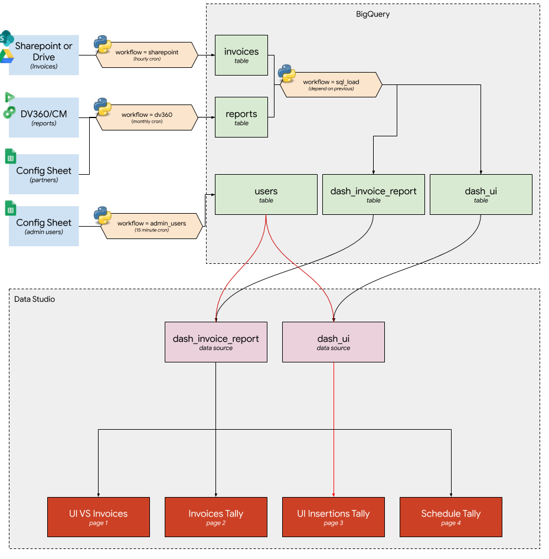

# B-Con

**_Disclaimer: This is not an officially supported Google Product._**

### What is B-Con?

B-Con (short for Billing Reconciliation) is a solution that makes it easier to reconcile invoices for Google Ad Products. This is useful for ad agencies as well as any team that has to deal with a large number of invoices every month from Google which may take a lot of time to reconcile with both the numbers reported in the product UI as well as the company's own internal purchase order/media order system.

### What problem does B-Con solve?

Assume you are an Ad Agency and on a monthly basis, your finance team receives 1000 invoices. The finance team needs to verify the amounts in each of these invoices and reconcile them before they can request payment from your clients and pay Google on their behalf. The steps involved typically are as follows:

1. **Receive invoices in PDF format via email.**
2. **Copy the data into an excel sheet for easier calculation.**
3. **Reach out to Adops to generate reports from the Product UI for the invoice period and compare them against the invoice.**
4. **Reach out again for discrepancies and any clarifications or re-running the report.**
5. **Compare against the purchase order for the specific client campaign and see how much has been delivered already.**
6. Create an invoice for the client and send it to them.
7. Make the payment to Google against the invoice.
8. Repeat this every month.

Steps 1-5 above take the longest time and it is not unusual for teams of individuals spending 2-3 weeks reconciling the numbers. B-Con helps by automating the most time consuming steps.

### Features

1. B-Con currently supports the following Google Ad Products. To support additional products, you B-Con can be modified by adding more API handlers.

   * Display & Video 360 (DV360)

   * Campaign Manager (CM)

2. Data is uploaded to BigQuery so it can be made available for Data Studio or other reporting dashboards.

3. Data access and permissions on dashboard are governed by actual permissions on CM and DV360. i.e. users can only see what they have access to in the product UI.

4. Configurable admin users who have access to all the data irrespective of UI permissions (required for Finance team)

5. Config sheet in Google Sheets which makes it easier to manage

6. Email addresses are one-way hashed with SHA256 so PII is not stored in database.

7. Multi-region and Multi-market support to keep the data and access separate.


## Operational Requirements

Prerequisites for B-Con are:

1. **Access to [Google Payments](payments.google.com)** - The finance team (or whoever will use B-Con) will need to have read access to Google Payments. This allows them to bulk download all the invoices in CSV format.
2. **Internal billing code in campaign name/insertion order name** - To reconcile each invoice entry accurately with the internal purchase order/media order system, the internal billing code needs to be included in the campaign name (for CM and DV360) or insertion orders (DV360 only)


## How does it work?



### Usage Flow

1. The Adops team includes the internal purchase order number in the advertiser name, campaign name or insertion order name. This has to be done when the campaign/insertion order is created. The reason for doing this is that invoices have one or more of advertiser name, campaign name or insertion order name listed in them and this is used to match the amount to the internal billing system.
2. When the invoices are available, the finance team downloads them from [Payments Center](payments.google.com) and uploads it to Sharepoint/Drive that B-Con is configured for.
3. B-Con performs the following steps:
   1. Process invoices
   2. Runs reports using product APIs
   3. Uploads all the data to BigQuery which feeds into Data Studio.

## Implementation

### Prerequisites

1. Google Cloud Project - B-Con uses the following features of Google Cloud:
   1. [Compute Engine](https://cloud.google.com/compute) - To run the backend load jobs
   2. [BigQuery](https://cloud.google.com/bigquery) - Where the data is eventually stored in.
   3. [Service Accounts](https://cloud.google.com/iam/docs/service-accounts) - B-Con uses service accounts to access the API.
2. [Data Studio](https://datastudio.google.com/) - Reporting dashboard to show the data from BigQuery

### Deploying B-Con

### Follow the steps below to get B-Con up and running.

1. Create a [Google Cloud Project](https://cloud.google.com/).

2. Enable billing or link to an existing billing account. This should be already taken care of if you are using your company's google cloud account.

3. Open [Google Compute Engine page](https://console.cloud.google.com/compute/instances).

4. Create a new VM instance with the following configuration:

   - Machine type: n1-standard-1 (1vCPU, 3.75 GB memory)
   - Under `Identify and API access` select the option `Allow full access to all Cloud APIs`. This is needed to download the service account key (explained later). Once the key is downloaded, you can modify this to `Allow default access`.

   Leave everything else as default and wait for the instance to get ready.

5. Open an SSH window by clicking on the ssh button.

6. Run update:

   ```sudo apt update && sleep 2 && sudo apt upgrade -y```

7. Check that the python version is at least 3.8. If it is 3.8 or later, then you can skip the next step.

   ```python3 --version```

8. If you don't have Python 3.8 or higher, you will need to compile Python from source. Follow the steps below to do this:

   1. Install the necessary tools and dependencies for Python:

      ```bash
      sudo apt install libsqlite3-dev libbz2-dev liblzma-dev uuid-dev libssl-dev zlib1g-dev libncurses5-dev tk-dev libgdbm-dev libreadline-dev libffi-dev git -y
      ```

      

   2. Download and compile python (`3.8.5` is latest at the time of writing)
      
      ```bash
      mkdir ~/python_versions
      cd ~/python_versions
      wget https://www.python.org/ftp/python/3.8.5/Python-3.8.5.tgz
      tar -zxf Python-3.8.5.tgz
      cd Python-3.8.5
      ./configure --enable-loadable-sqlite-extensions --enable-optimizations --with-ensurepip=install
      make
      ```
      
      Wait for the compilation to complete.
      
   3. While still in the same folder, add it to the path and make sure it's accessible when needed:

      ```bash
      ln -s python python3
      echo "export PATH=\"`pwd`:\${PATH}\"" >> ~/.bash_aliases
      source ~/.bash_aliases
      ```

   4. Check that the latest version is now at least 3.8.

      ```bash
      python --version && python3 --version
      ```

   5. Go back to the home folder:

      ```bash
      cd
      ```

9. Setup the code:

   1. Clone the b-con repository:

      ```bash
      git clone https://github.com/google/b-con.git
      ```

      This creates the folder `b-con`.

   2. Create a python virtual environment:

      ```bash
      cd b-con
      python3 -m venv v
      ```

   3. Activate the virtual environment:

      ```bash
      source v/bin/activate
      ```

   4. Install the python requirements:

      ```bash
      pip install wheel
      pip install -r requirements.txt
      ```

10. Enable APIs on the Cloud account - These are all the APIs that B-Con will be accessing.

    1. Go to [APIs and Services](https://console.cloud.google.com/apis) in Google Cloud and click on "Enable APIs and Services"
    2. Search for and enable the following APIs:
       1. DoubleClick Bid Manager API
       2. Display & Video 360 API
       3. DCM/DFA Reporting And Trafficking API
       4. Google Sheets API
       5. Google Drive API
       6. BigQuery API

11. Create a service account which will  be used to access all the APIs:

    1. Go to `APIs & Services > Credentials` in [Google Cloud](https://console.cloud.google.com/apis/credentials).

    2. Select `Create Credentials` and select `Service Account`.

    3. Call it `bcon-robot`. And then click `Create`.

    4. In permissions give it the following roles:

       1. BigQuery Data Editor
       2. BigQuery Job User

       Hit `Continue`.

    5. Click `Done`.

    6. Copy the email address of the service account which should look like this: `bcon-robot@<project-id>.iam.gserviceaccount.com`. This will be used in the next step.

12. Back in compute engine ssh window, create a new key for the service account you created and download the file to VM:

    ```bash
    cd ~/b-con
    gcloud iam service-accounts keys create bcon_robot.json --iam-account bcon-robot@<project-id>.iam.gserviceaccount.com
    ```

    This will download the private keys into the VM.

    ## WARNING on service accounts!

    **The private key in the json file will allow anyone who possesses the file to access anything that service account has access to, even if the users themselves don't have access to (Ex: Bigquery, DV360, CM etc). So take precaution to give access to only the relevant people to the VM and the private key file.**

13. Grant access permissions to the service account to DV360 and CM

    1. **DV360** - Create a new user for the service account email. It needs to be given "Reporting Only" access to all the partners that you want to use it with. Refer to [this page](https://support.google.com/displayvideo/answer/2723011?hl=en) for more details.
    2. **CM** - Create a new user profile for the service account. It needs to be given "Advanced Agency Admin" access to all the campaign manager accounts. Refer to [this page](https://support.google.com/campaignmanager/answer/6098287) for more details.

14. **BigQuery setup** - Open the [BigQuery page](https://console.cloud.google.com/bigquery) and do the following:

    1. Create a new dataset called `bcon`within the project.
    2. In the dataset, create empty tables (no columns) with the following names:
       1. dash_ui
       2. dash_invoice_report
       3. reports
       4. invoices
       5. invoice_entries
       6. admin_users
       7. user_perms
       8. cm_dash_ui
       9. cm_dash_invoice_report
       10. cm_reports
       11. cm_user_perms
       12. cm_advertiser_accounts
       13. cm_user_perms_advertiser

15. Configuration - The following steps will allow you to set up the configuration.

    1. **Google Sheets**:

       1. Make a copy of [this sheet](https://docs.google.com/spreadsheets/d/1Zk6dr2EznLZOwzQctPUaTXl9Pk4FSv-WTQXPsoAu7s4/edit?usp=sharing).
       2. Update either the Sharepoint tab or the Drive tab depending on which file storage system you are using.
       3. Add the DV360 partners to the Partners tab.
       4. Add the admin users to the Admin users tab. Note that admin users are the same for DV360 and for CM.
       5. Grant read access to the email address of the service account created earlier.

    2. **Code config:**

       1. Back in the ssh window, make a copy of `config_template.yaml` and call it `config.yaml`:

          ```
          cp config_template.yaml config.yaml
          ```

          

       2. Update the details as per  the documentation in the file. Note that you only need either sharepoint or drive and not both.

       3. If you are using b-con for multiple markets and wish to keep them separate, you can include more than one config sheet in `config.yaml`.

16. **Running B-Con** - All the scripts needed for running B-Con are in the scripts folder. You need to be in the root folder of B-Con to run them as follows (for example):

    ```
    cd ~/b-con
    scripts/run_dv360.sh
    ```

17. **Business Logic** - The python code only fetches the data and uploads it to BigQuery. All the business logic is in the sql scripts. This is visible in the folder `sql`. To run the sql scripts, you can run `scripts/run_sql_load.sh`.

18. **Cron setup** - You can set up cron jobs for all the scripts so that they run regularly. Note that since we're using a virtual environment for python, you will need to give the commands like the example below. This runs the specific script `run_drive.sh` and then runs `run_sql_load.sh`. 

    ```bash
    # Run every 60 minutes.
    */60 * * * * cd /home/<user>/b-con;source v/bin/activate;scripts/run_drive.sh > /tmp/run_drive.log 2>&1;scripts/run_sql_load.sh > /tmp/run_sql_load.log 2>&1;deactivate
    ```

    There are many resources available online on setting up cron on a linux machine, so we will not go further into this here.

19. **User permissions scripts** - B-Con syncs the user access permissions from DV360 and Campaign Manager to ensure that data is visible only to the relevant users. This is done by the scripts `scripts/run_user_perms.sh` and `scripts/run_cm_user_perms.sh`. Care should be taken that these scripts are set up in cron to run regularly so that the access permissions are propagated.

20. **User permissions views**

    1. `views/v_admin_users.sql` is a convenience view for admin users which can be set up on BigQuery and used in data studio.
    2. `views/v_user_perms.sql` is a convenience view for DV360 users which can also be set up in BigQuery. It lists the advertiser id that each user has access to.

    Both these views can be set up and used to filter data for users as shown below.

21. **Data Studio setup** - It is recommended to use [Google Data Studio](https://datastudio.google.com) for accessing and sharing the information since it integrates well with BigQuery. More info available [here](https://datastudio.google.com/).

22. **Data Studio user permissions setup** - Data studio allows you to set up the dashboard in a way that only the users who have access to a particular advertiser in CM or DV360 will see the data. B-Con makes the user permissions available at the advertiser level in the tables `cm_user_perms_advertiser` and `user_perms`. The email address in these tables is hashed with SHA256 and then encoded to Base64. This can be used to manage per user access to the data in Data studio as follows. This requires the `@DS_USER_EMAIL` parameter enabled in data studio as explained [here](https://support.google.com/datastudio/answer/9713766?hl=en).


    Here is an example script:

    ```sql
    SELECT DISTINCT
      d.*
    FROM `<project-id>.bcon.dash_invoice_report` AS d
    LEFT JOIN `<project-id>.bcon.users` AS u
      ON CAST(d.advertiser_id AS INT64) = u.advertiser_id
    WHERE TO_BASE64(SHA256(LOWER(@DS_USER_EMAIL))) = u.user
      OR TO_BASE64(SHA256(LOWER(@DS_USER_EMAIL))) IN (
        SELECT user
        FROM `<project-id>.bcon.v_admin_users`
      ) -- Admin
    ```


    
